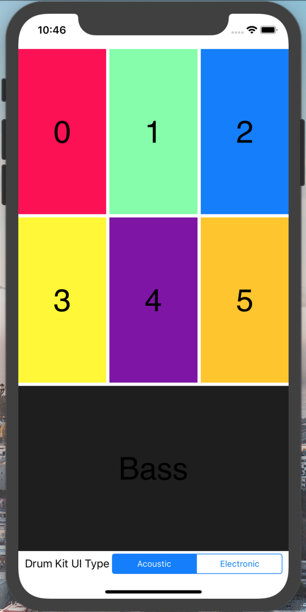

# DrumKit #

Basic drum kit UI plus sound functionality using Swift 4.0 and Apple's AudioToolbox framework. Users can jam out using the application's 7 pre-loaded drum samples under two modes: Acoustic and Electronic. 

## Motivation ##

The motive of this project was to implement a very basic drum kit application while learning about Apple's AudioToolbox framework and autolayout constraints used in other iOS applications. 

## Technology and frameworks used ##

**Built with**
  * Swift 4.0
  * XCode 10.1
  * CocoaPods
  * [Apple's Audio Toolbox](https://developer.apple.com/documentation/audiotoolbox "Audio Tools")
  
## Installation ## 

1. Pull files from the repo.
2. Open Drummer.xcodeproj on XCode.
3. Select which simulator you'd like to run the application on in the top left corner of XCode. 
4. Build and run simulator.

## How To Use ## 

1. Select which mode you'd like to play in through the bottom tab bar. 
2. Make sure that your sound and ringer is on.
3. Tap away! 

## Credits ## 

Initial project idea and spec credits go to Berkeley's iOS Decal 2019. 
Full implementation carried out by Micah Yong. 

## Support ## 

If you find any of my projects helpful/inspiring and would like to support me, please do so [here](https://venmo.com/Micah-Yong "Venmo")
